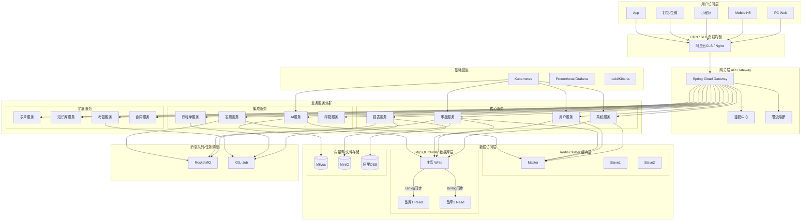
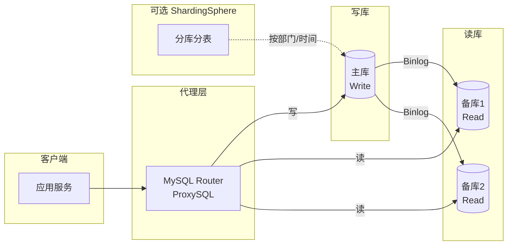
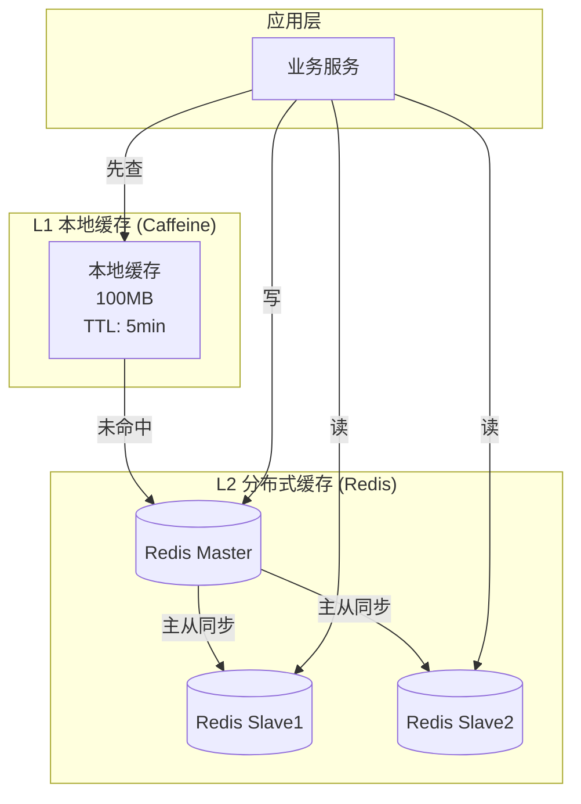
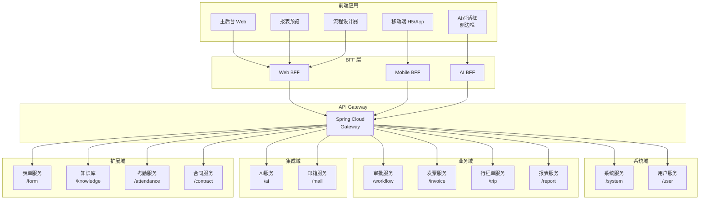
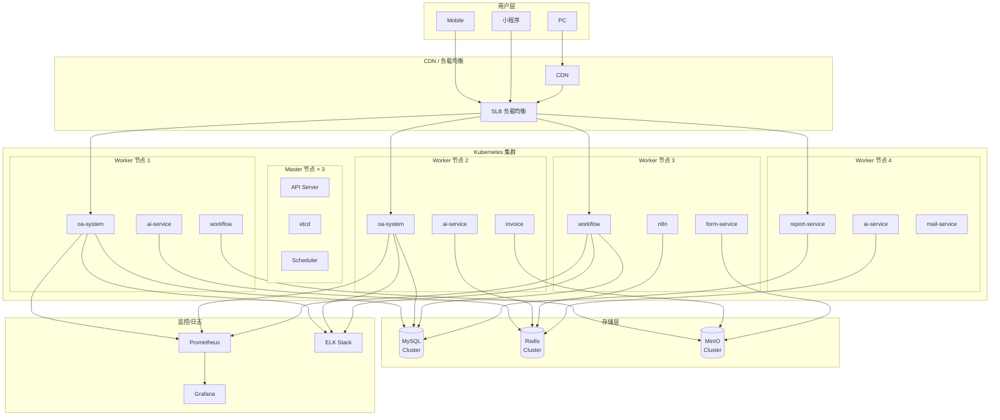
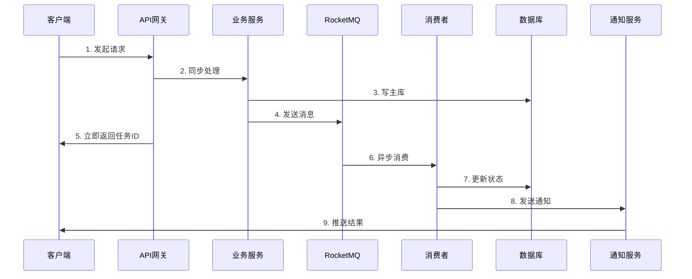
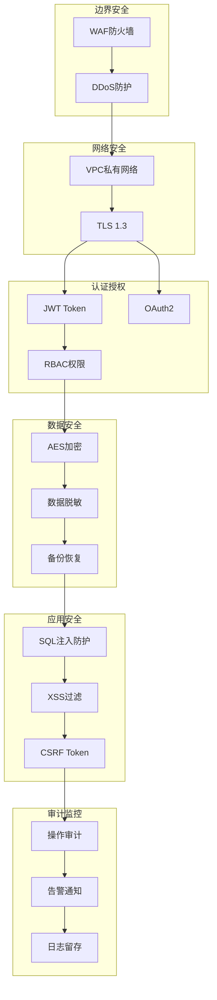

# LRuoYi-OA 系统架构图 (Mermaid)

> 可在 GitHub / Typora / VSCode 等支持 Mermaid 的编辑器中渲染

## 1. 整体架构图

## 2. 数据库读写分离架构

## 3. Redis 缓存架构

## 4. 微服务模块划分

## 5. 高并发部署架构

## 6. 异步任务处理流程

## 7. 安全架构

---

*使用说明：将代码块内容复制到支持 Mermaid 的编辑器中即可渲染*
